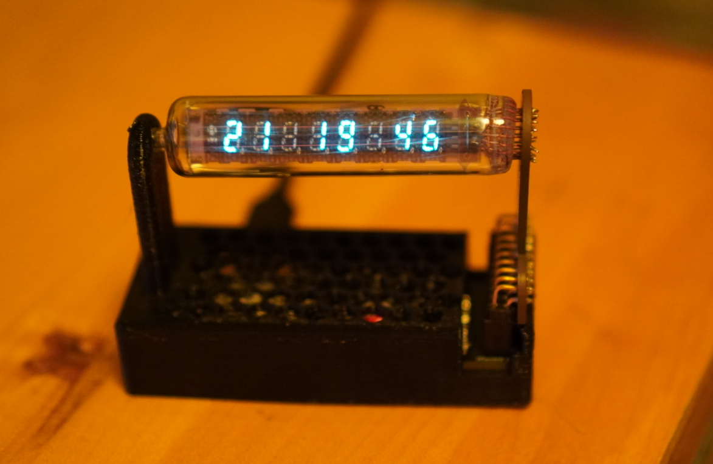

# iv-21-clock-esp32
Basic clock designed around a IV-21 FL tube

# Attributions
- This project was largely mutated from [sjm4306s project](https://hackaday.io/project/167749-tiny-iv-21-vfd-clock)
- The max6921 control code was borrowed from [DellaRaccoon](https://github.com/DellaRaccoon/vfd-control/tree/master)
- the mcp3x21 code was pulled from "Andon", I do not recall where I found it.
- As always, many thanks to [Adafruit](https://www.adafruit.com/) for all of their contributions to circuit python

# What is on the board
- A FL tube, a IV-21
- XIAO board. I am using a ESP32C3, but many micro controllers work
- mcp3x21 A2D converter for getting feedback of the drive voltage for the device 

# Design files
Find the board files [Here](eagle-files)

# Code
The esp32 code can be found [here](esp32-code)

This code is still a WIP. It doesn't do more than display some numbers.

Most of the code development tims so far was just in getting the dc-2-dc circuit working correctly.

This is an image from the first night that I got the tube to light up:

